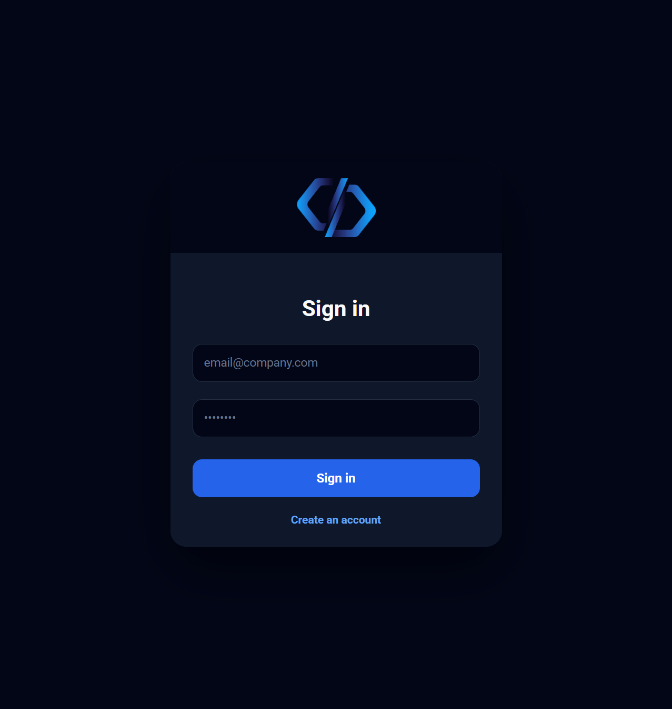
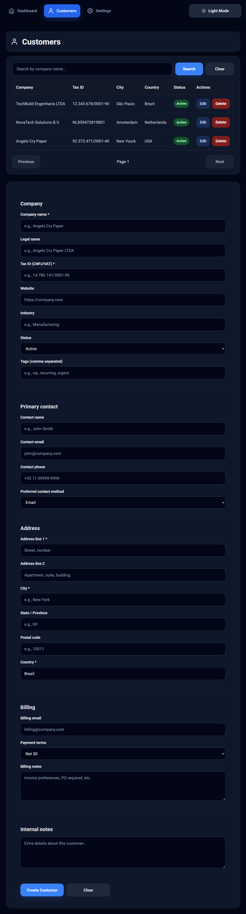
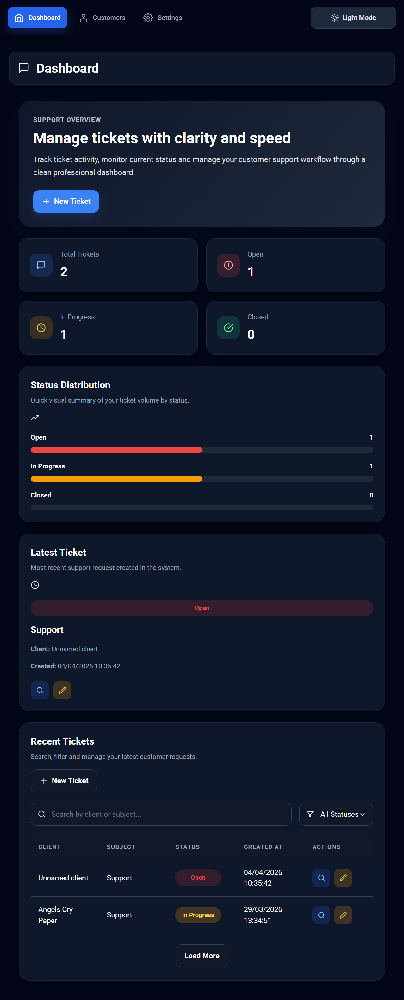
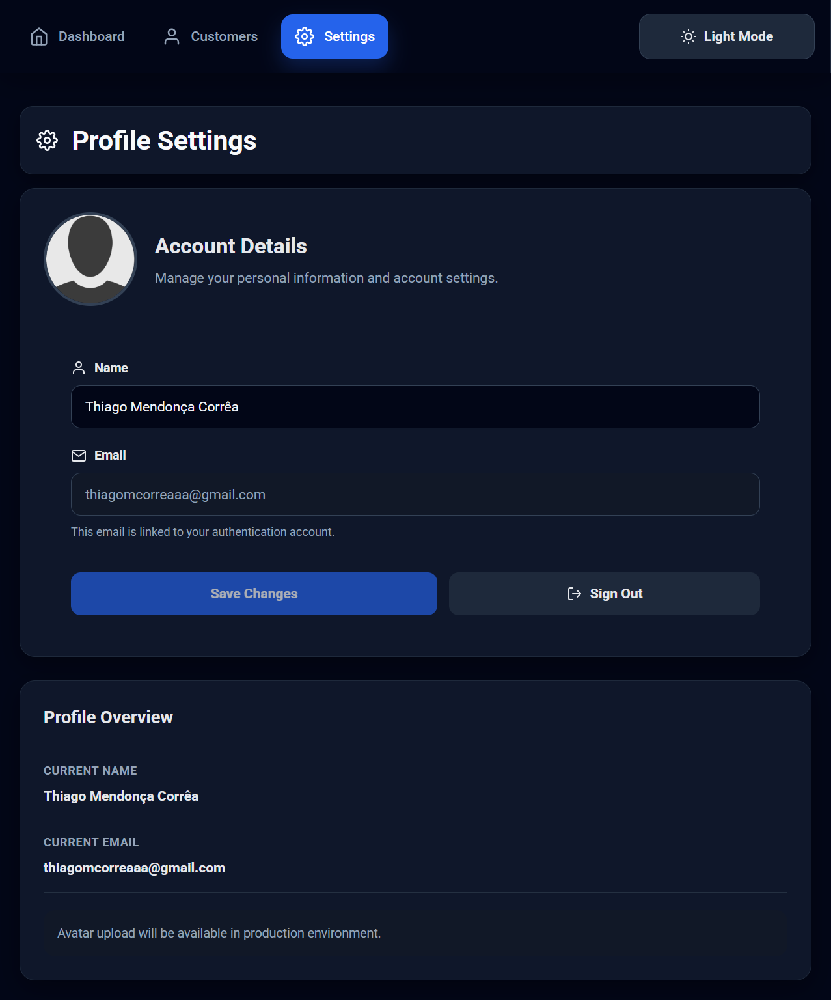

🎫 Support Ticket System (React + Firebase)

## 📸 Preview

A modern customer support system built with React and Firebase, designed to manage tickets, customers, and support workflows with a clean and scalable architecture.

🔗 Live Demo:
https://sistema-chamados-react-aula.netlify.app/

📌 Overview

This project is a ticket management system that allows authenticated users to create, manage, and track customer support tickets.

It demonstrates frontend architecture, authentication flow, protected routes, real-time database integration, and pagination using Firebase services.

🚀 Tech Stack
Frontend

React

React Router

Date-fns

Backend-as-a-Service

Firebase Authentication

Firebase Firestore (NoSQL database)

🔐 Authentication

User registration (Sign Up)

Login / Logout

Protected routes

Session persistence using localStorage

Context API for global authentication state

🎯 Features

Create new tickets

List tickets with pagination (Firestore limit + startAfter)

View ticket details in modal

Update ticket status:

Open

In Progress

Closed

Associate tickets with clients

Responsive interface

🏗 Project Architecture
src/
 ├── components/
 ├── contexts/
 ├── pages/
 │    ├── Dashboard/
 │    ├── Customers/
 │    ├── Profile/
 │    └── SignIn / SignUp
 ├── routes/
 ├── services/
 └── App.js
Architecture Highlights

Context API for global authentication management

Modular folder structure

Firestore pagination strategy

Separation between UI components and page logic

Route protection logic

📸 Screenshots

(Add screenshots here)

Recommended:

Login page

Dashboard

Ticket modal

Create ticket page

⚙️ How to Run Locally
1️⃣ Clone the repository
git clone https://github.com/thiagomcorrea/sistema-chamados.git
cd sistema-chamados
2️⃣ Install dependencies
npm install
3️⃣ Configure Firebase

Create a .env file in the root directory:

REACT_APP_FIREBASE_API_KEY=your_key
REACT_APP_FIREBASE_AUTH_DOMAIN=your_domain
REACT_APP_FIREBASE_PROJECT_ID=your_project_id
REACT_APP_FIREBASE_STORAGE_BUCKET=your_bucket
REACT_APP_FIREBASE_MESSAGING_SENDER_ID=your_sender_id
REACT_APP_FIREBASE_APP_ID=your_app_id
4️⃣ Start the project
npm start
🔒 Firestore Security

Firestore rules should restrict access to authenticated users only.

Example rule:

rules_version = '2';
service cloud.firestore {
  match /databases/{database}/documents {

    match /tickets/{ticket} {
      allow read, write: if request.auth != null;
    }

    match /customers/{customer} {
      allow read, write: if request.auth != null;
    }
  }
}

🌍 Deployment

The project is deployed using Netlify.

Build command:

npm run build

Publish directory:

build/
🧠 What This Project Demonstrates

Real-world authentication flow

Protected routing logic

Firestore querying and pagination

State management using Context API

Modular React architecture

CRUD operations with real-time database

🔮 Possible Improvements (Roadmap)

Upgrade to React Router v6

Migrate to Firebase v9 modular SDK

Add filtering by status

Add search functionality

Add role-based permissions

Improve Firestore security rules

Add automated tests

👨‍💻 Author

Thiago Corrêa
Full Stack Developer

GitHub: https://github.com/thiagomcorrea

LinkedIn: https://www.linkedin.com/in/thiago-mendonca-corr%C3%AAa-1837929a/
